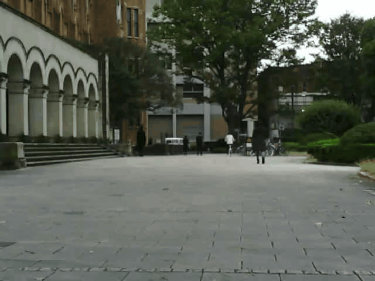

# Pan-LUT: Efficient Pan-sharpening via Learnable Look-Up Tables
## 📮 Updates
- **[2026.1.6]** The code for our Look-Up Tables is now released!
---
## ⚙️ Environment

```
conda create -n panlut python=3.8
conda activate panlut
```
## Demo
## Pan-sharpening(Remote Sensing Image Fusion)

## Multi-exposure Image Fusion
## Infrared and Visible Image Fusion

## Medical Image Fusion

