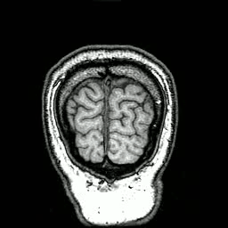

# Pan-LUT: Efficient Pan-sharpening via Learnable Look-Up Tables
## 📮 Updates
- **[2026.1.6]** The code for our Look-Up Tables is now released!
---
## ⚙️ Environment

```
conda create -n panlut python=3.8
conda activate panlut
pip install torch==1.12.0+cu113 torchvision==0.13.0+cu113 torchaudio==0.12.0 --extra-index-url https://download.pytorch.org/whl/cu113
cd PGLUT
python install setup.py
cd SDLUT\SDLUT_transform
python install setup.py
...
cd IFLUT
python install setup.py
```
## Demo
## Pan-sharpening(Remote Sensing Image Fusion)

## Multi-exposure Image Fusion
## Infrared and Visible Image Fusion

## Medical Image Fusion

## 🚀 Inference
## 🔥 Train
