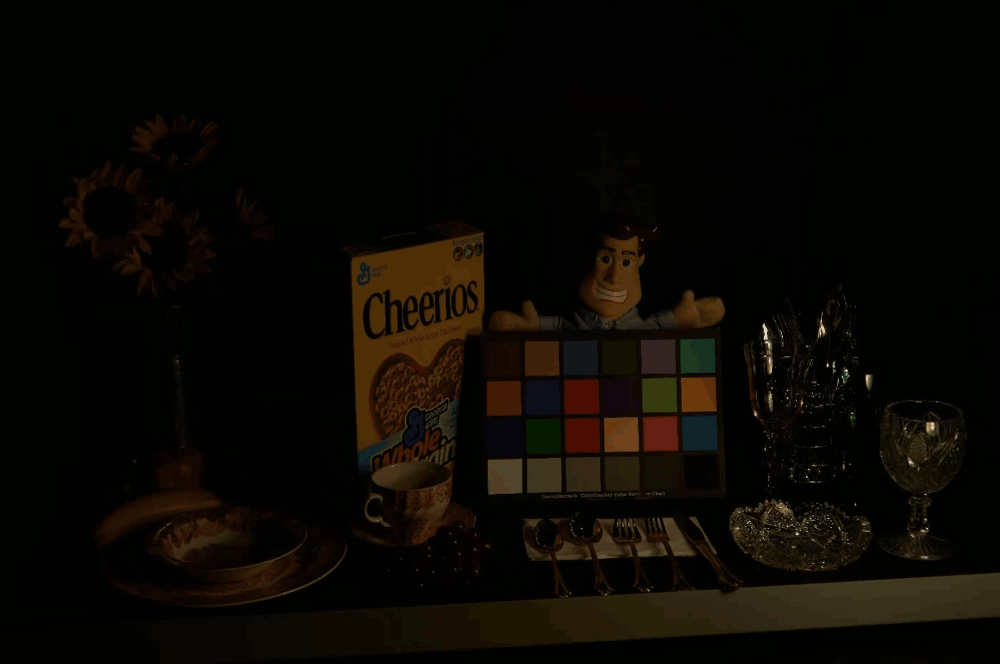
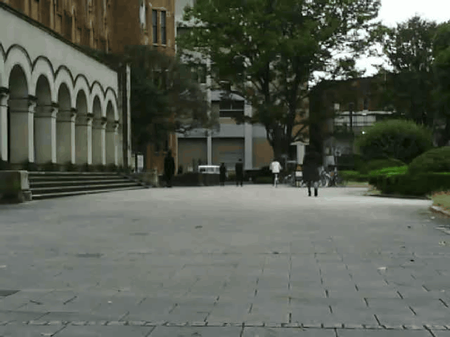
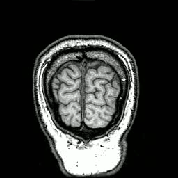

# Pan-LUT: Efficient Pan-sharpening via Learnable Look-Up Tables
## 📮 Updates
- **[2026.1.6]** The code for our Look-Up Tables is now released!
---
## ⚙️ Environment

```
conda create -n panlut python=3.8
conda activate panlut
pip install torch==1.12.0+cu113 torchvision==0.13.0+cu113 torchaudio==0.12.0 --extra-index-url https://download.pytorch.org/whl/cu113
cd PGLUT/PGLUT_transform
python setup.py install
cd SDLUT/SDLUT_transform
python setup.py install
...
cd IFLUT/IFLUT_transform
python setup.py install
cd IF4DLUT/IF4DLUT_transform
python setup.py install
```
## Demo
```
python demo.py --task vif --image_A ./demoimg/input/00040N_vi.png --image_B ./demoimg/input/00040N_ir.png --out ./demoimg/result_vif.png
python demo.py --task mef --image_A ./demoimg/input/over.jpg --image_B ./demoimg/input/under.jpg --out ./demoimg/result_mef.png
python demo.py --task mff --image_A ./demoimg/input/far.jpg --image_B ./demoimg/input/near.jpg --out ./demoimg/result_mff.png
```
## 🚀 Inference
## 🔥 Train

## Pan-sharpening(Remote Sensing Image Fusion)

## Multi-exposure Image Fusion

## Multi-focus Image Fusion

## Infrared and Visible Image Fusion

## Medical Image Fusion

